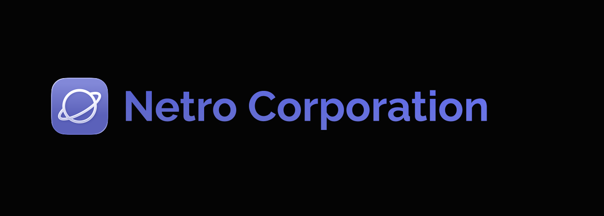
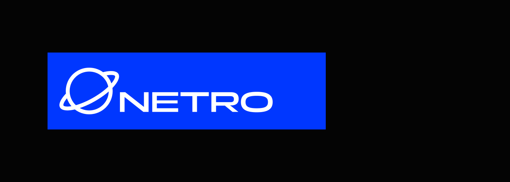
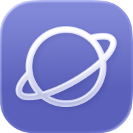
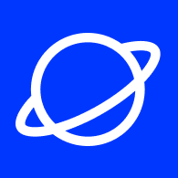
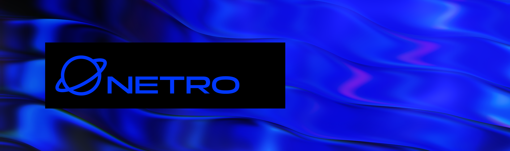
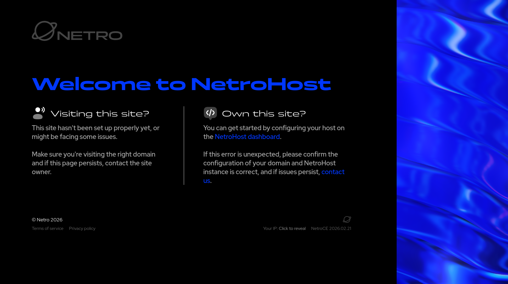

When we first saw NETRO's current design language, we knew it had great potential, but was lacking in flavour. We wanted to help them refresh their brand identity, and reached out offering support. We were happy to hear their positive response to our concepts, and we moved forward with the designs.

We started with the logo, we wanted to keep their current identity intact, whilst giving it a fresh coat of paint;

</img-caption>

</img-caption>

We decided to keep the "planet" look, and continue with the blue colour scheme, enhancing the saturation and contrast heavily to make it stand out.

-----

## The Icon

| Old                     | New                     |
|-------------------------|-------------------------|
|  |  |

When upgrading the logo to the new design language, we recreated the icon from scratch, reusing the same shape and design, but thickening the lines and cleaning up the shape.

The size of the ring around the planet was also enlarged slightly, giving it more space to breathe.

-----

## Wordmark and Name

When approaching the name, we ran into one large problem, the current name: "Netro Corporation" - we pushed very early to rename it, and eventually they decided to cut the Corporation, leaving it as just "Netro", occasionally stylized as "NETRO", which gives a much more professional and friendly look.

For the wordmark, we went with the font "Panchang" for it's wide letters and sharp corners, along with it's unique letter shaping. For placement, we placed it just slightly tucked underneath the ring of the planet, aligned to the bottom left.

This leads to a few interesting design hurdles when placing the logos around designs, primarily that placing it in the direct center of the design can be problematic, which leads to designs using the logo being more unique and interesting.

This pushes designers working with the logo to think about more interesting ways to use it and position it on a design, rather than just placing it in the most obvious place or where a template might suggest.

-----

## Visual Flair

Placing the logo directly on blue, black, or white of course works great, but we wanted to additionally provide the option of a more unique visual flair; we went with these unique moving blue bars, which for example are used on the [Company's Homepage](https://netro.works) and across their other products.

We used [Unicorn Studio](https://unicorn.studio) to create these graphics, leading to high-resolution assets and WebGL shaders embeddable directly into websites, something we couldn't have pulled off without it.

<unicorn-player src="./img/bars.json" width=1000 height=500></unicorn-player>

-----

## Fonts & Colours

For fonts, we used [Panchang](https://www.fontshare.com/?q=Panchang) from Fontshare, not only for the wordmark, but also for headings and large texts across web designs.

For content, we went with [Red Hat Display](https://fonts.google.com/specimen/Red+Hat+Display) for its clean and legible typeface and geometric shapes across the letters.

</img-caption>

When it comes to colours, we went for a very saturated blue for headers, an almost-white for content, and a pure black background across most the site.

    

 
Accent & Headers

    

 
Content

    

 
Background

This gives a very clean and modern look, with the blues standing out heavily against any background. Our intent was to make the logo stand out and be recognizable from anywhere, at any distance.

-----

## The Glyph Box

<side-box>
<unicorn-player src="./img/glyph.json" width=300 height=300></unicorn-player>
</side-box>

The Glyph Box was one of our favourite design elements of this project, being used in a few areas like their homepage and their physical business cards.

Again, this was created using Unicorn Studio using their built-in Glyph effect, which we layered on top of a flat 3d model of the logo, giving it a 3D look and feel. The logo is refracted on top of the waves, and also masks to the logo shape, adding the blue waves as well.

The output is transparent, meaning it can be placed on top of things, behind things, or anything else.

-----

## Where Next?

We've just finished up this logo and brand design in the past few days, next for us is to create the full website design and UI language for Netro, which we'll be working on closely alongside their team soon. We can't wait to show you what we've been working on for the UI!

You can get a teaser on their current (temporary) homepage at [netro.works](https://netro.works), but we're working away on the full new site design slowly and carefully.

Almost all of the designs you've seen here were done by me, [Tanza](https://tanza.me) with much support and guidance from NETRO's team. If you'd like to see more of my personal works, please check out my [portfolio](https://tanza.me/portfolio)!
