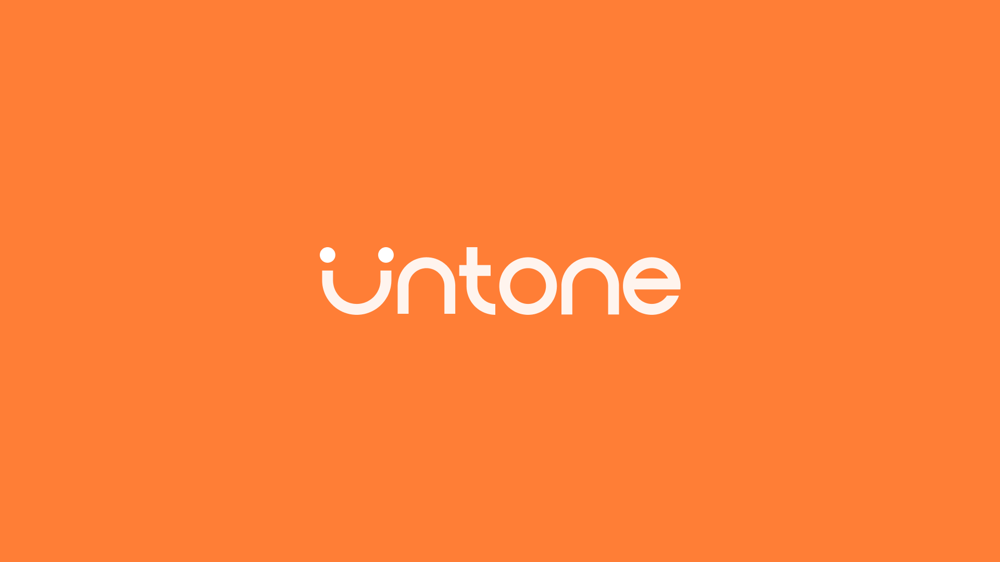
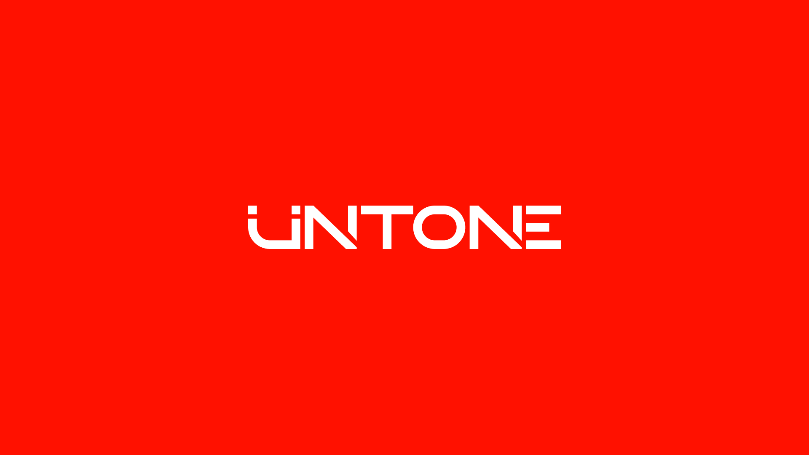
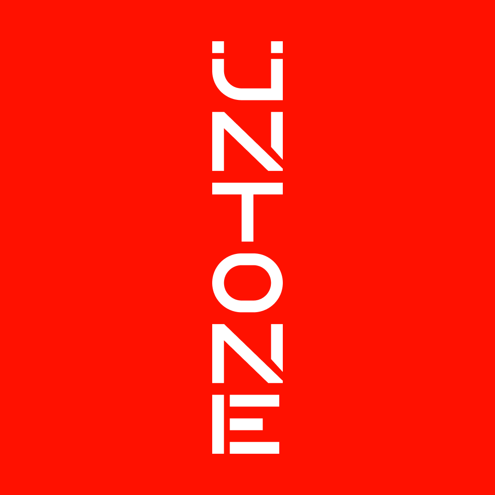
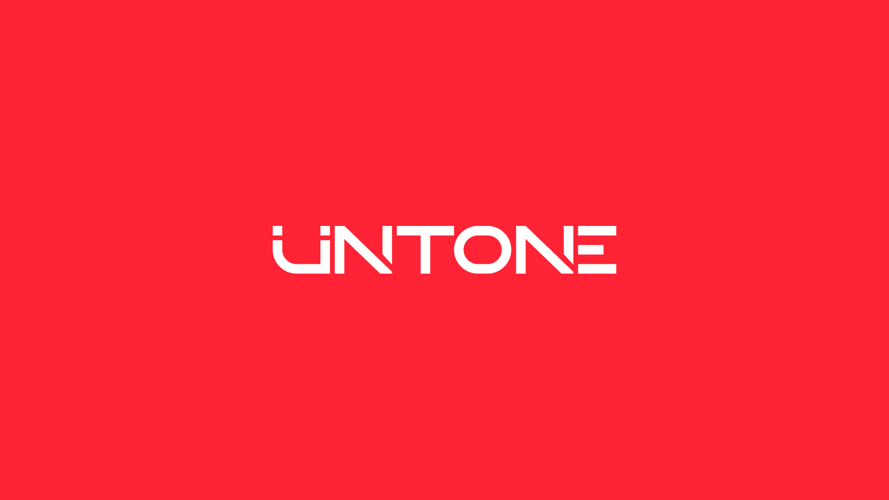

Last year, the time came around to give UNTONE a proper new branding package to last us as long as possible. We
finalized it using a pure red of #FF0000, aiming for saturation and brightness.

| Old, orange-styled logo    | New, red-style logo ("Red Sunset") |
|----------------------------|------------------------------------|
|  |          |

We had two main goals with this new branding: we wanted to imbue a more "technical" feeling into our wordmark, showing our more development-orianted side, whilst still keeping it friendly and approachable to show the music and design.

In my opinion, this went great: the new wordmark is sharper, using custom letterforms with (almost*) equal width, allowing it to be reorinted in any direction. We kept the smiley face with the "u" letter, making it sharper and more recognizable along the way (as internally, it became a weekly occasion for someone to spot an "untone" logo in the wild (a smiley face))

</img-caption>

> ^ the "E"'s stem is merged with the end of the "N" letter in the horizontal configuration - this is not the case in the vertical configuration
>  if you watch closely in the intro of https://untone.org, you can actually see the stem of the E fade in suddenly when the logo takes it's vertical form before sliding!

This logo was used for a year, up until today, when I looked at it and realized something; god DAMN was it red. too red. So we started experimenting with some new colours, and we landed on something much softer:

| Red logo                   | Softer, less red logo                     |
|----------------------------|-------------------------------------------|
|  |  |

The difference is subtle, but it's very much there; we kept the red channel at 255, but upped the green to 35, and blue to 53, giving it a slightly desaturated pinkish tint, coming off much more approachable and less "ow, my eyes"

-------

## What now?
This is already deployed on the site, and we're rolling out the new colour scheme to our social media platforms as well. I thought it'd be nice to share my thoughts and mistakes on the process of making this logo, and the reasoning behind the new logo itself and the new colour scheme we've rolled out today.